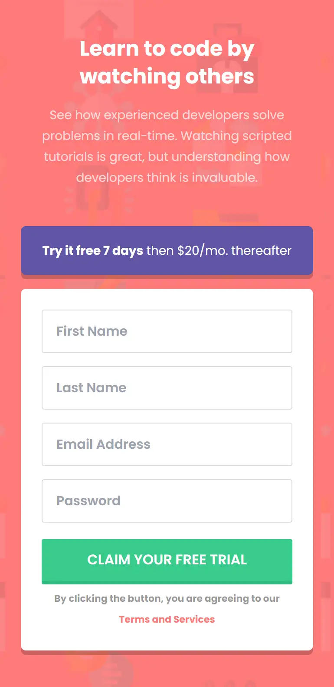
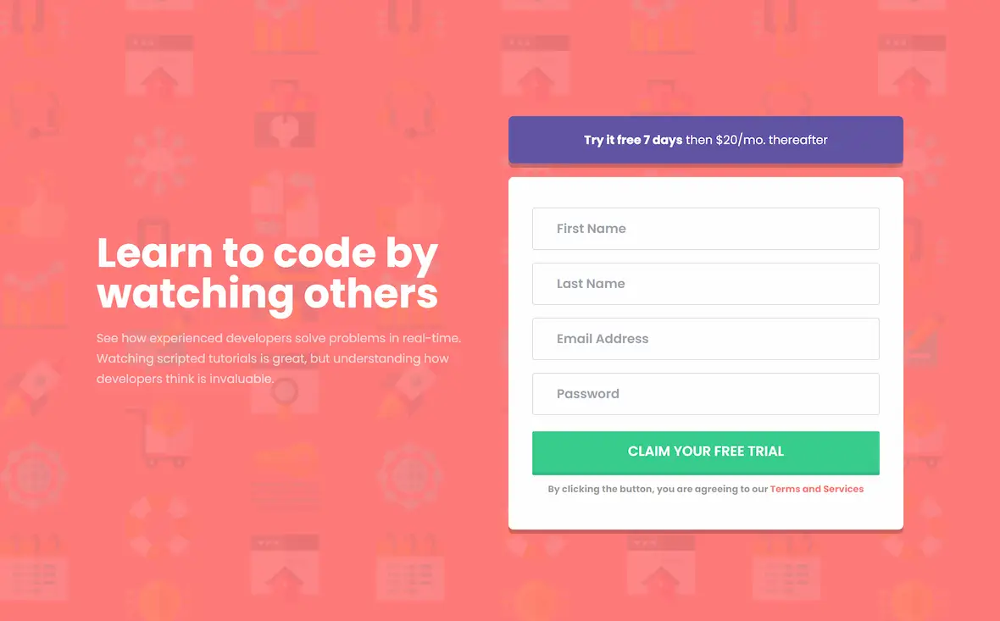

# Frontend Mentor - Intro component with sign up form solution

This is a solution to the [Intro component with sign up form challenge on Frontend Mentor](https://www.frontendmentor.io/challenges/intro-component-with-signup-form-5cf91bd49edda32581d28fd1). Frontend Mentor challenges help you improve your coding skills by building realistic projects.

[Solution][solution-url] . [Live Page][live-page]

Table of contents

-   [Overview](#overview)
    -   [The challenge](#the-challenge)
    -   [Screenshots](#screenshots)
    -   [Links](#links)
-   [My process](#my-process)
    -   [Built with](#built-with)
    -   [What I learned](#what-i-learned)
-   [Author](#author)

## Overview

### The challenge

Users should be able to:

-   View the optimal layout for the site depending on their device's screen size
-   See hover states for all interactive elements on the page
-   Receive an error message when the `form` is submitted if:
    -   Any `input` field is empty. The message for this error should say _"[Field Name] cannot be empty"_
    -   The email address is not formatted correctly (i.e. a correct email address should have this structure: `name@host.tld`). The message for this error should say _"Looks like this is not an email"_

### Screenshots

<table>
        <tr>
		            <td>
                
            </td>
            <td>
                
            </td>
        </tr>
</table>

### Links

-   [Solution][solution-url]
-   [Live Page][live-page]

## My process

### Built with

-   Semantic HTML5 markup
-   Flexbox
-   Mobile-first workflow
-   [React](https://reactjs.org/) - JS library
-   [Vite](https://vitejs.dev) - Build tool
-   [Tailwind CSS](https://tailwindcss.com/) - CSS framework

(<a href="#top">back to top</a>)

### What I learned

This challenge was a great learning opportunity, it was also very useful to reinforce previous knowledge, and face problems that had not been presented to me before.

## Author

-   Instagram - [@cosmo_art0](https://www.instagram.com/cosmo_art0/)
-   Frontend Mentor - [@CosmoArt](https://www.frontendmentor.io/profile/cosmoart)
-   Twitter - [@CosmoArt0](https://twitter.com/cosmoart0)
-   My personal page - [https://cosmoart.github.io](https://cosmoart.github.io)

(<a href="#top">back to top</a>)

[live-page]: https://cosmo-intro-component-with-sign-up.netlify.app
[solution-url]: https://github.com/othneildrew/Best-README-Template/graphs/contributors
